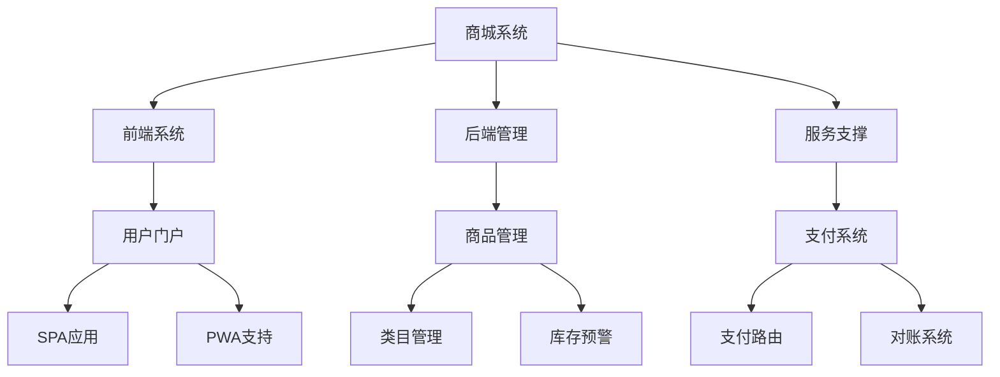

我将使用专业的需求分析方法帮助您完善商城系统需求，以下是结构化分析过程：

一、需求结构化分析（5W2H框架）
1. What（核心目标）
- 基础目标：实现商品在线交易
- 进阶目标建议补充：
  √ 用户增长与留存机制
  √ 订单转化率优化方案
  √ 商家入驻管理平台
  √ 数据化运营分析系统

2. Who（用户角色）
建议明确以下角色及其权限：
```markdown
| 角色        | 功能权限                      | 业务需求                  |
|-------------|-----------------------------|-------------------------|
| 游客        | 浏览商品、注册登录           | 转化率优化              |
| 买家        | 购物车、订单、支付、售后     | 交易安全保障            |
| 卖家        | 商品管理、订单处理、数据分析 | 多店铺管理              |
| 平台管理员  | 用户管理、数据监控、系统配置 | 风险控制机制            |
```

3. Why（商业价值）
需补充关键业务指标：
- 预计日均订单量
- 目标客单价范围
- 支付成功率要求
- 系统可用性SLA

4. How（功能架构）
核心模块建议：


二、关键问题识别
1. 合规风险：
- 需明确支付牌照解决方案
- 用户隐私数据存储方案
- 跨境业务的税务合规设计

2. 技术风险：
- 高并发场景下的库存超卖问题
- 第三方支付接口的故障降级方案
- 敏感操作的风控机制缺失

三、需求完善建议
1. 必备功能补充：
- 分布式事务处理（订单-库存-支付）
- 灰度发布能力设计
- 营销活动冲突检测机制
- 全链路监控体系

2. 推荐技术方案：
```markdown
| 领域          | 推荐方案                          | 优势说明                |
|---------------|-----------------------------------|-----------------------|
| 前端架构      | Next.js + Micro Frontend          | 支持SSR和模块化开发    |
| 后端架构      | Spring Cloud Alibaba              | 完善的微服务生态       |
| 数据存储      | TiDB + Redis + Elasticsearch      | HTAP架构支持           |
| 部署方案      | Kubernetes + Istio                | 服务网格化管理         |
```

四、需求文档模板
提供标准化文档结构建议：
```markdown
# 商城系统需求规格说明书
## 1. 业务背景
## 2. 系统架构
### 2.1 逻辑架构图
### 2.2 部署架构图
## 3. 功能需求
### 3.1 商品服务（含状态转换图）
### 3.2 订单服务（含状态机设计）
## 4. 非功能需求
### 4.1 性能指标（TPS/QPS）
### 4.2 安全要求（等保级别）
## 5. 里程碑计划
```

是否需要我针对某个具体模块（如秒杀系统、推荐引擎）进行详细需求展开？